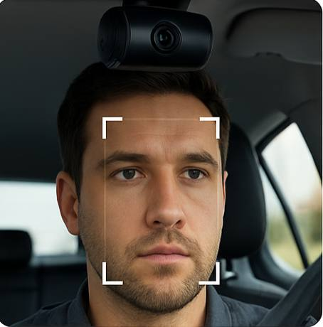
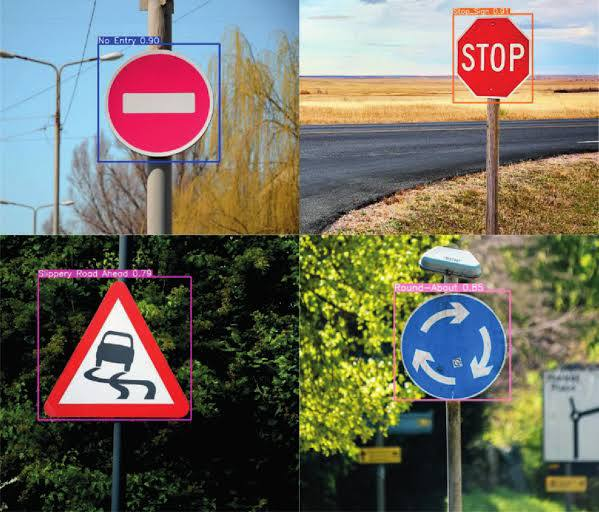

# 🤖 Artificial Intelligence in ADAS Project

This section of the project focuses on the Artificial Intelligence (AI) features integrated into our Advanced Driver Assistance System (ADAS). The goal of this AI module is to enhance driver and vehicle safety through intelligent, real-time analysis using Computer Vision and Deep Learning techniques.

## 🔍 Key Features

The AI module includes the following core features:

### 1. Driver Face Recognition (DFR)
A facial recognition system that ensures only authorized individuals can operate the vehicle. It scans the driver’s face and compares it with registered profiles. If an unrecognized face is detected, the system takes action to prevent unauthorized access.

 </br>
-  Chosen Method: `face_recognition library` (with OpenCV)
-  Alternative methods explored: YOLO + face_recognition, DeepFace, CNN
-  Reason for choice: Real-time speed, ease of use, requires only one image per person

### 2. Driver Monitoring System (DMS)
This system monitors the driver's attentiveness and fatigue level by analyzing facial landmarks and eye movements. It classifies the driver's state (alert, distracted, drowsy) and can trigger alerts to avoid accidents.

 </br>
-  Chosen Method: Facial Landmark Detection + EAR (Eye Aspect Ratio) using Dlib
-  Other explored methods: Biometric Signals, CNN, YOLO, Speech Recognition
-  Key Metrics: Eye blink rate, head position, drowsiness detection

### 3. Traffic Sign Recognition (TSR)
An intelligent vision system that detects and classifies road signs (e.g., speed limits, stop signs) in real-time, helping the driver follow traffic rules even under poor visibility or distraction.

 </br>
-  Chosen Method: `YOLO` Object Detection
-  Dataset used: GTSRB (German Traffic Sign Recognition Benchmark)
-  Output: Real-time recognition of signs with bounding boxes and labels

---

## 🧠 Technologies Used

- **Computer Vision**: OpenCV
- **Deep Learning**: PyTorch, face_recognition, YOLO
- **Libraries**: Dlib, NumPy, Scikit-learn
- **Models**: CNNs, YOLO, Pre-trained face models

---

## 🗂️ Project Structure

```bash
    ├── main.py               
    ├── config.py          
    ├── requirements.txt      
    ├── README.md             
    ├── src/                  
    │   ├── models/         
    │   │   ├── __init__.py
    │   │   ├── yolo_model.py  
    │   │   ├── face_recognition.py 
    │   │   └── driver_monitoring.py
    │   └── utils/            
    │       ├── __init__.py
    │       └── helper.py          
    ├── training/                
    │   ├── training_YOLOv11.ipynb             
    │   ├── training_YOLOv5.ipynb      
    │   └── training_YOLOv8.ipynb         
    └── tests/              
        ├── test_camera.py    
        └── test_models.py 
```
